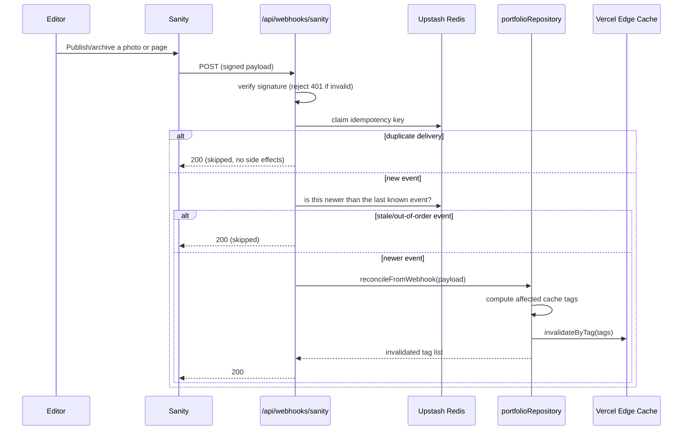

# Caching, Invalidation, and Webhooks

## Cache tags

| Tag                        | Invalidated when                        |
| -------------------------- | --------------------------------------- |
| `site`                     | `siteSettings` changes                  |
| `page:home`                | `siteSettings` or `homePage` changes    |
| `page:about`               | `siteSettings` or `aboutPage` changes   |
| `page:contact`             | `siteSettings` or `contactPage` changes |
| `gallery`                  | any photo changes                       |
| `gallery:category:{value}` | a photo in that category changes        |
| `gallery:series:{value}`   | a photo in that series changes          |
| `gallery:tag:{value}`      | a photo with that tag changes           |
| `photo:{slug}`             | that specific photo changes             |

Built by `src/server/cache/tags.ts`; applied to responses in
`src/server/cache/vercel-headers.ts` via the `Vercel-Cache-Tag` header, and
purged through `invalidateCacheTags()` in `src/server/cache/vercel.ts`
(`@vercel/functions`' `invalidateByTag`, with a REST API fallback if that
fails).

## Cache policy defaults

| Route type                            | `Cache-Control`                                           |
| ------------------------------------- | --------------------------------------------------------- |
| Home / About / Contact / Photo detail | `max-age=60, s-maxage=3600, stale-while-revalidate=86400` |
| Gallery / filtered list pages         | `max-age=0, s-maxage=300, stale-while-revalidate=3600`    |

TanStack Router loader cache: page loaders use `staleTime=60_000,
gcTime=300_000`; gallery loaders use `staleTime=30_000, gcTime=300_000`.

A short-lived (30s) in-memory cache of the full photo list also exists inside
`sanityProvider` to protect against redundant Sanity API calls within a warm
serverless instance. It's explicitly busted (`invalidateAllPhotosCache()`) on
every webhook/reconcile write, so it can never serve pre-change data right
after an edit.

## Webhook flow

`POST /api/webhooks/sanity` — configure the webhook's GROQ projection in the
Sanity dashboard (Settings → API → Webhooks) as:

```groq
{"documentId": _type, "slug": slug.current, "_updatedAt": _updatedAt}
```



Without `UPSTASH_REDIS_REST_URL`/`UPSTASH_REDIS_REST_TOKEN` configured, the
idempotency/ordering checks fall back to an in-memory store scoped to a
single warm serverless instance — degraded but still functionally safe
(duplicate invalidation is harmless by design).

## Scheduled reconciliation

`GET/POST /api/reconcile/content`, triggered by `vercel.json`'s cron entry,
runs **daily** (not hourly) because Vercel Hobby/free-plan cron jobs are
capped at once per day — see
[decisions/0002-remove-cloudinary.md](../decisions/0002-remove-cloudinary.md)
for other free-tier constraints discovered along the way. The webhook above
is the real-time invalidation path; the cron job is only a drift-correcting
safety net for missed/failed webhook deliveries.

Auth: Vercel automatically sends `Authorization: Bearer <CRON_SECRET>` for
its own cron invocations once `CRON_SECRET` is set as a project env var.
`RECONCILE_SECRET` is a second accepted token for manual/emergency calls.

## Failure behavior

- **Publication safety**: always fail closed. If provider state is
  ambiguous, never expose a `draft` or `archived` photo publicly.
- **Sanity read failures**: serve the last known-good snapshot if one exists
  (logged as degraded); otherwise fall back to minimal safe defaults for
  `siteSettings` only, and return a 503-safe UI for pages/photos rather than
  fabricating content.
- **Webhook failures**: invalid signature → 401 + security log. Downstream
  purge failure after a valid, verified event → log and allow a future
  webhook/reconcile run to catch up.
- **Out-of-order events**: compare the provider's update timestamp against
  the last known timestamp per entity; ignore older events for both mutation
  and invalidation decisions.

## Observability

Structured JSON logs (`src/server/observability/logger.ts`) cover webhook
receipt/verification/dedupe decisions, cache invalidation target lists,
reconcile start/end/result, and provider failures — with fields like
`provider`, `eventType`, `slug`, `documentId`, `cacheTags`, `idempotencyKey`,
`requestId`, `durationMs`, `outcome`. These go to Vercel Runtime Logs for
free; no external error-tracking service (e.g. Sentry) is wired up by
default, to stay dependency-light and fully within free tiers.
