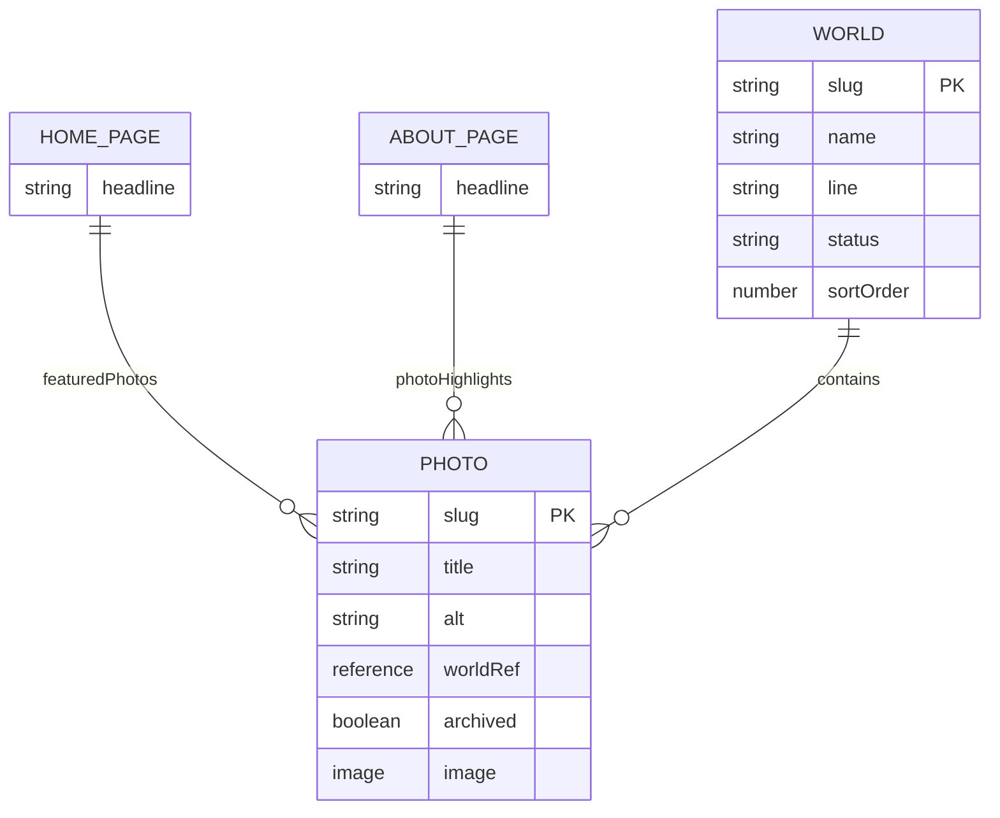

# Data Layer

This document covers the provider/repository contracts, the `Photo` data
model, and how routing/pagination work. For caching and webhooks, see
[caching-and-webhooks.md](./caching-and-webhooks.md). For image delivery, see
[image-delivery.md](./image-delivery.md).

## Layer contracts

### `sanityProvider`

Source: `src/server/providers/sanity.ts` · Contract: `src/server/contracts/index.ts`

- Exposes: `getSiteSettings()`, `getHomePage()`, `getAboutPage()`,
  `getContactPage()`, `searchPhotos(filters)`, `getPhotoBySlug(slug)`,
  `listChangedPhotos(since)`, `listChangedDocuments(since)`,
  `verifyWebhook(request)`.
- Returns only provider-normalized `Photo` records and typed page content —
  never raw Sanity payloads or UI-ready view models.
- Owns: GROQ queries, schema typing, draft exclusion (via the `published`
  perspective), EXIF/palette/GPS extraction and formatting, webhook signature
  verification.
- Forbidden from: building route URLs, or deciding public visibility beyond
  raw `status`/`archived` rules.
- Without Sanity credentials configured, every method serves the bundled
  fixture archive (`src/server/providers/mock-data.ts`) instead — see
  [../guides/getting-started.md](../guides/getting-started.md).

### `portfolioRepository`

Source: `src/server/repository/portfolio.ts`

- Exposes: `getGalleryFeed(filters)`, `getPhotoDetail(slug)`, `getHomeView()`,
  `getAboutView()`, `getContactView()`, `getSeoPayload(route)`,
  `reconcileFromWebhook(payload)`, `reconcileSince(timestamp)`.
- Resolves curated photo references (Home/About) to full `Photo` records.
- Owns: publication filtering (fail-closed for draft/archived), stale-cache
  fallback behavior, route-safe slug lookup, cache tag mapping, canonical URL
  construction.
- Forbidden from: calling the Sanity SDK directly — always goes through
  `sanityProvider`.

### UI / loaders / routes

- Consume repository outputs (via `src/server/server-functions/portfolio.ts`)
  only.
- Forbidden from importing the Sanity client SDK, env vars, or raw CMS
  payload types.

## Data models

### `Photo`

| Field                                                                    | Notes                                                                                                                                                                                                                                               |
| ------------------------------------------------------------------------ | --------------------------------------------------------------------------------------------------------------------------------------------------------------------------------------------------------------------------------------------------- |
| `publicId`                                                               | Local fixture id (`local/<id>`) or a Sanity image CDN base URL — the identity `PhotoImage` renders from. Not a Cloudinary artifact despite the name (kept for historical/minimal-diff reasons).                                                     |
| `slug`                                                                   | Sanity's native `slug` field — human-readable, editor-controlled.                                                                                                                                                                                   |
| `status`                                                                 | `'draft' \| 'published' \| 'archived'`. `draft` is enforced by Sanity's own draft/publish workflow (never returned by a `published`-perspective query). `archived` is an explicit boolean field for retiring a published photo without deleting it. |
| `title`, `alt`, `caption`, `description`                                 | Editorial fields. `alt` is required by Sanity schema validation — a photo cannot be published without it.                                                                                                                                           |
| `category` (Sanity field: `worldRef`), `series`, `locationLabel`, `tags` | Organization/filtering fields. `worldRef` points to a reusable `world` document; the provider still reads the legacy `world` string during migration.                                                                                               |
| `captureDate`, `sortOrder`                                               | Ordering and display.                                                                                                                                                                                                                               |
| `metadataVersion`                                                        | Currently `v2` — see [decisions/0002-remove-cloudinary.md](../decisions/0002-remove-cloudinary.md) for why it was bumped from `v1`.                                                                                                                 |
| `metadata.{width,height,format,bytes}`                                   | Sourced from the Sanity asset's own metadata.                                                                                                                                                                                                       |
| `metadata.{camera,lens,focalLength,iso,shutterSpeed,aperture,gps}`       | Sourced from the photo document's own fields when an editor has set them, falling back to the asset's auto-extracted EXIF/GPS. Never invented — absent EXIF just stays absent.                                                                      |
| `metadata.palette`                                                       | Up to 5 hex colors extracted from Sanity's palette swatches (`dominant`, `vibrant`, `darkMuted`, `muted`, `lightVibrant`), used for ambient wash effects.                                                                                           |
| `image?.lqip`                                                            | Base64 blur-placeholder data URI, used directly as the `` background — no extra network request.                                                                                                                                               |
| `image?.hotspot`                                                         | Editor-set focal point (`{x, y}`, 0–1), used for hotspot-aware cropping in cropped presets.                                                                                                                                                         |

### Sanity documents

`siteSettings` and `contactPage` are singletons with no photo references, so
they're omitted from the diagram above — see the field tables in
[content-management.md](../guides/content-management.md) for their fields.

- `siteSettings`, `homePage`, `aboutPage`, `contactPage` — singletons, pinned
  in Studio (see `apps/studio/structure.ts`) so editors can't create
  duplicates or delete the only copy.
- `photo` — the canonical photo document: a native Sanity `image` field
  (`hotspot: true`, `metadata: ['exif', 'location', 'palette', 'lqip',
'blurhash']`), a native `slug` field, editorial fields, and an `archived`
  boolean.
- `world` — reusable name, slug, editorial description, public status,
  ordering, hero-photo reference, photographic color mood, and SEO metadata.
- `homePage.featuredPhotos` / `aboutPage.photoHighlights` are arrays of
  `reference` to `photo` documents — curate by picking existing photos, not
  re-uploading.
- Reusable objects: `seo`, `socialLink`, `cta`.

## Routing, pagination, and query strategy

Public routes: `/` (home), `/archive` (gallery/index), `/photos/$slug`
(detail), `/notes` (about), `/signal` (contact).

- **Pagination**: cursor-based, not page-number based. The cursor is opaque
  and encodes `(sortOrder, captureDate, slug)`. Default page size `24`, max
  `48`.
- **Sorting**: `sortOrder desc`, then `captureDate desc`, then `slug asc`. No
  user-facing arbitrary sort in v1.
- **Filters**: `category` and `series` (single value), `tag` (single value in
  v1; the query param is repeatable for future AND-filtering).
- **Canonical URLs**: query params are canonicalized in the order `category`,
  `series`, `tag`, `after`; empty/default params are omitted. Cursor-paginated
  non-first pages are `noindex,follow`.
- **Photo detail lookup**: resolves by `slug`. Unknown slug → 404. Photo
  exists but `status !== 'published'` (including `archived`) → 404 publicly,
  never a 403 that would confirm existence.
