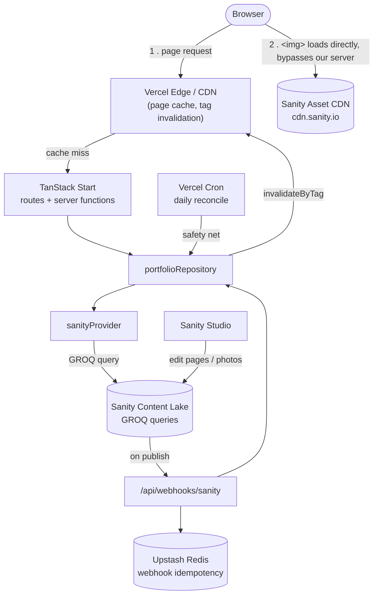

# Architecture Overview

FrameOS is a photography portfolio built on **TanStack Start** (React 19 SSR
framework) with **Sanity** as the single content and photo provider, deployed
on **Vercel**. There is no separate photo/image CDN — Sanity's own asset
pipeline handles storage, transforms, and delivery.

## System diagram

The detail that matters most: once a page is rendered, **photos load straight
from Sanity's CDN in the browser** — they never round-trip through our
server. Our server only ever handles the small JSON/HTML payloads (page data,
photo metadata). This is why Sanity's bandwidth allowance is the number that
matters for cost, not our own Vercel function usage.

## Stack

| Layer             | Technology                                          |
| ----------------- | --------------------------------------------------- |
| App framework     | TanStack Start (React 19, Vite, TypeScript strict)  |
| Styling           | Tailwind CSS v4                                     |
| Content + photos  | Sanity (Content Lake + native image asset pipeline) |
| Caching           | Vercel CDN cache tags, TanStack Router loader cache |
| Idempotency store | Upstash Redis (optional, degrades to in-memory)     |
| Hosting           | Vercel (Hobby/free tier by default)                 |

See [decisions/0001-tanstack-start-baseline.md](../decisions/0001-tanstack-start-baseline.md)
and [decisions/0002-remove-cloudinary.md](../decisions/0002-remove-cloudinary.md)
for how this stack was chosen.

## Layers and responsibilities

- **`sanityProvider`** (`src/server/providers/sanity.ts`) — the only module
  that knows GROQ, Sanity's client SDK, or the raw document/asset shape. Owns
  photo search/pagination, EXIF/palette extraction and formatting, and
  webhook signature verification. Falls back to bundled fixture content when
  no Sanity project is configured (see
  [../guides/getting-started.md](../guides/getting-started.md)).
- **`portfolioRepository`** (`src/server/repository/portfolio.ts`) — the only
  consumer of `sanityProvider`. Turns provider output into page-ready view
  models, enforces publication rules (fail closed for draft/archived
  content), builds canonical URLs, maps changes to cache tags, and serves
  stale snapshots when Sanity is unavailable.
- **Server functions** (`src/server/server-functions/portfolio.ts`) — thin
  TanStack Start `createServerFn` wrappers that call the repository and
  attach cache-control headers.
- **Routes** (`src/routes/**`) — consume server functions only. Never import
  the Sanity SDK, env vars, or raw provider types directly.

Full contract details, the `Photo` data model, and routing/pagination rules
live in [data-layer.md](./data-layer.md).

## Where to go next

- [data-layer.md](./data-layer.md) — provider/repository contracts, data models, routing
- [caching-and-webhooks.md](./caching-and-webhooks.md) — cache tags, the webhook flow, reconciliation
- [image-delivery.md](./image-delivery.md) — image presets and Sanity CDN transform URLs
- [../guides/](../guides/) — task-oriented how-tos (setup, content, deployment)
